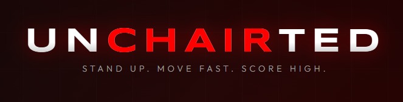

# ⚡ Unchairted: Get Out of Your Chair

**Stop sitting all day!** Unchairted helps you stay active at your desk. It uses your webcam to track your moves and make office breaks fun.

### Why Unchairted?
- **Private.** No video is ever sent to a server.
- **Simple.** Works in your browser, no install needed.
- **Fun.** A better way to spend your break.

To test locally: 
python -m http.server 8000

---

To run: 
http://localhost:8000
