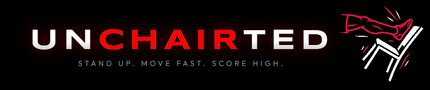
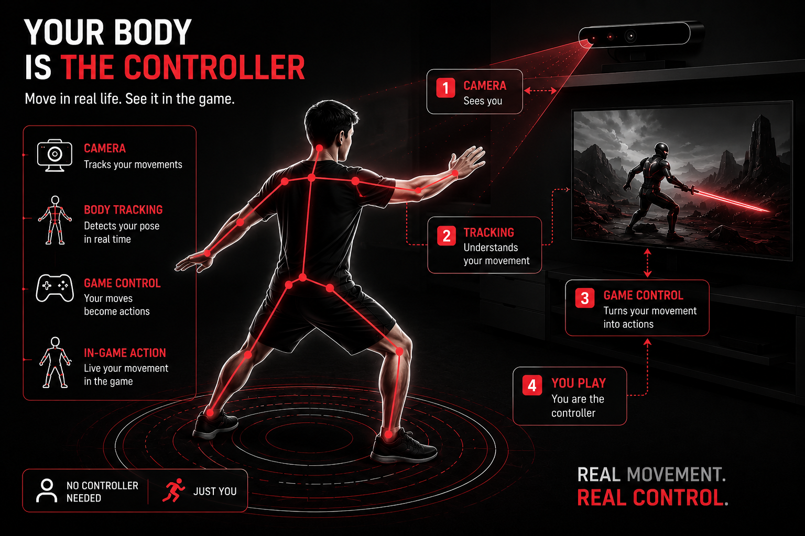
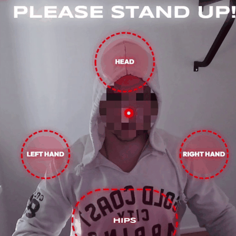
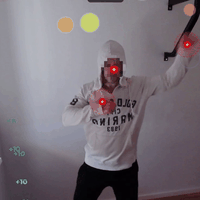
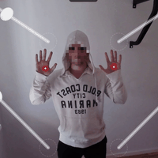
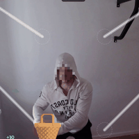

# 🪑 UNCHAIRTED: Stop Sitting



### 💬 Around 60–80% of office workers report back or neck pain related to prolonged computer use.

## 🎯 The Motivation
You're a developer, a designer, or some other flavor of "desk-bound professional." You spend **12+** hours a day glued to your chair. By the time you stand up, your spine feels like a bag of dry spaghetti that’s been stepped on.

Sure, you *could* do some "boring" stretches. But as a Computer Vision engineer, I figured: why settle for boring when I can turn my webcamera into a personal trainer that judges my reflexes? 

That’s how **UNCHAIRTED** was born. It’s not just a game; it’s an intervention for your posture.

## 💀 The "Sitting is Killing You" Part
This isn't just me being dramatic. According to the [**Mayo Clinic**](https://sportsmedicine.mayoclinic.org/news/risks-of-sitting-too-much/), sitting for more than 8 hours a day with no physical activity carries a risk of death similar to that of **obesity and smoking**. 

Your chair is basically a slow-motion trap. **Don't let it win.** 🪑❌

## 🎮 What we’re offering
UNCHAIRTED is a web-based movement game that turns your body into the **controller**. 
*   **100% Local**: No servers, no data-storing, no "we're watching you." All processing happens in your browser via MediaPipe.
*   **Zero Install**: If you have a browser, you have a gym.
*   **High Energy**: All you need is a webcam and a pair of headphones for the sick beats.

<p align="left">
  
</p>

## 🔍 Calibration: Set Up for Success
Before jumping into any game, you need to calibrate the pose tracking system. This ensures that the model accurately maps your body parts and alignment zones.

1. **Step Back**: Place your webcam so it can capture your entire upper body (ideally from head to hips).
2. **Align the Targets**: Stand in the frame and match your head, hands, and hips with the respective circular target zones on the screen.
3. **Hold Still**: Hold your position until the indicators turn green and you see the glowing **PASSED** message.

<p align="left">
  
</p>

### Game Modes (More coming soon!)

#### 🧼 Mode 1: Bubble Hunter
The sky is falling, and it's made of soap. 
*   **The Goal**: Pop as many bubbles as you can with your hands.
*   **The Catch**: If they fly past you, you lose points. 
*   **The Threat**: A giant red laser will occasionally sweep the screen. If you don't **DUCK**, you lose 50 points and your dignity. 
*   **Scoring**: Pop = +10 | Miss = -10 | Laser Hit = -50.

<p align="left">
  
</p>

#### 🥚 Mode 2: Egg Catcher
Remember that classic handheld game where the wolf catches eggs? (Yeah, the Soviet "Nu, Pogodi!" one). It’s that, but you're the wolf.
*   **The Goal**: Use your hands to control a virtual basket and catch eggs falling from four different chutes.
*   **The Catch**: Eggs are fragile. If they hit the floor, it’s a mess and a penalty.
*   **Scoring**: Catch = +10 | Break = -10.

<p align="left">
  
  
</p>

## 🩺 The Health Check (Muscle Map)
Playing this isn't just for points; it's for your gains.

| Mode | Muscles Worked | Exercise Preview |
|------|----------------|------------------|
| **Bubble Hunter** | Deltoids, Traps, Obliques, Quads/Glutes |  |
| **Egg Catcher** | Reflexes, Core Stability, Lower Body, Lower Back |  |

> [!TIP]
> It's basically a HIIT session disguised as a browser game. Great for kids too—keeps them moving instead of slouching!


## 💎 Why you’ll love it
1.  **Privacy**: Your video stream stays on your machine. Period.
2.  **Simplicity**: Open the link, hit play, start sweating.
3.  **It’s actually fun**: Way better than a "time to stand up" popup notification.
4.  **Back Health**: Your spine will thank you (eventually).

## 🚀 How to run it locally
Want to try it out on your machine? It's easier than centering a div.

1.  Clone the repo.
2.  Run a local server:
    ```bash
    python -m http.server 8000
    ```
3.  Open your browser and go to:
    `http://localhost:8000`

## ⭐ Show some love!
If this project helps your back feel even 1% less like a pretzel, please **give it a star on GitHub!** It keeps me motivated to add more modes and features. ⭐⭐⭐

## 🎵 Credits
Massive shoutout to [Pixabay](https://pixabay.com/) for the awesome tracks and sound effects that make the game feel alive.

---
*Stop sitting. Start moving. Be Unchairted.* ⚡
